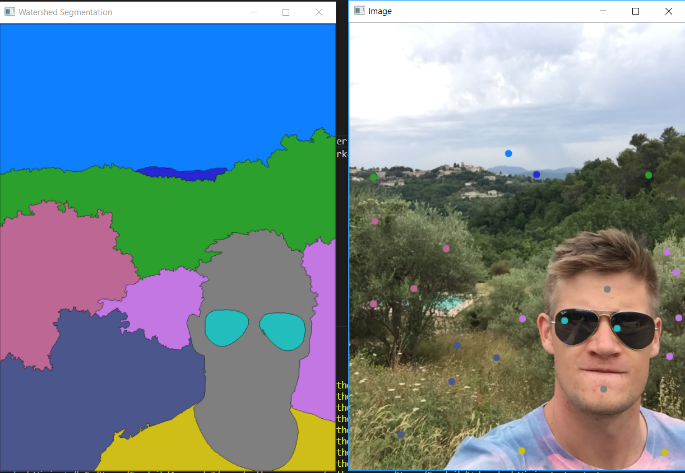

# Watershed-Vision

This is an simple implementation of the Watershed algorithm with keypoints marked by the user.

## Requirements
* Python 3.6
* OpenCV
* Numpy
* Matplotlib

## Installation
Download repo and run *watershed_vision.py*. To change picture and size, edit line 5 and 8 in *watershed_vision.py*.

## Controls
* Esc - close
* c - clear
* 1-9 - Choose marker color
* LBUTTON - place marker

### Thanks
Inspired by Jose Portilla